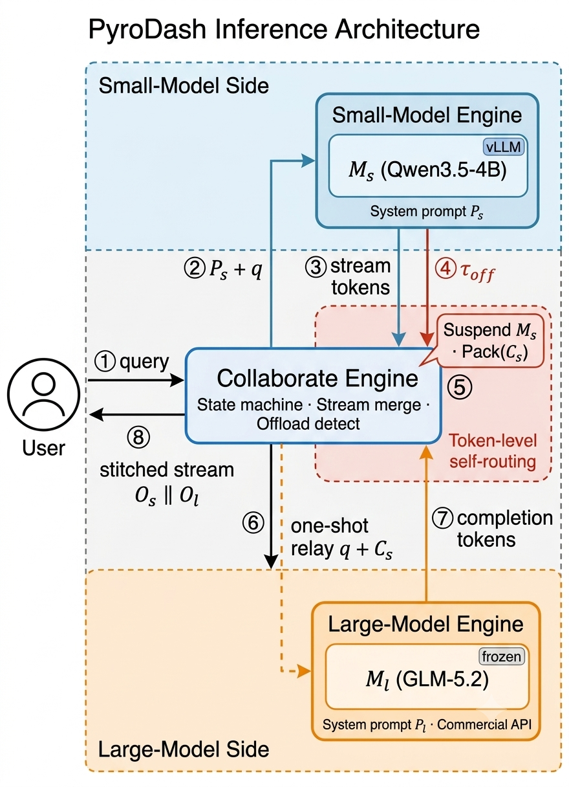
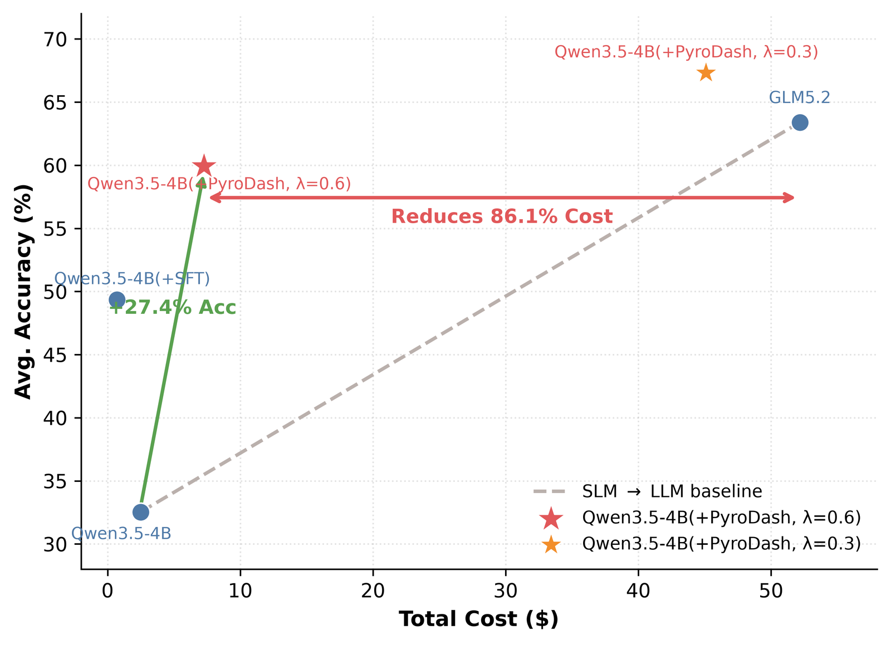

# pyroDash

**Language / 语言:** [English](README.md) | [中文](README_zh.md)

<a href="TODO_PAPER_URL"></a>&nbsp;&nbsp;<a href="TODO_MODEL_URL"></a>&nbsp;&nbsp;<a href="TODO_REPRODUCE_URL"></a>

---

> **Quick reproduce:** Click [🚀 Quick Reproduce](TODO_REPRODUCE_URL) to open our company platform and reproduce the evaluation end-to-end with one click.

<table>
<tr>
<td width="50%" valign="top">

</td>
<td width="50%" valign="middle" style="padding: 0 2em;">

&emsp;&emsp;We propose **PyroDash**, a token-level dynamic reasoning paradigm for collaborative inference between small and large language models. PyroDash enables the small model to autonomously emit the control token `<|llm_offload|>` during autoregressive streaming decoding; the collaboration engine then dynamically offloads the local reasoning chain to a large model based on this control signal. This approach requires neither an additional router model nor retraining of the large model, and is naturally compatible with closed-source LLM services.

</td>
</tr>
</table>

During training, PyroDash follows a three-stage progressive optimization pipeline: (1) train the control-token embedding layer so the small model acquires basic offloading expressiveness; (2) cold-start the offload capability to establish a collaboration pattern between the small and large models; and (3) apply GRPO reinforcement learning that jointly optimizes the dynamic offloading policy with a task-accuracy reward and a large-model call-cost penalty, achieving an adaptive balance between reasoning quality and compute cost. For more details, please refer to our [paper](TODO_PAPER_URL).

---

## 🚀 Quick Start

### 1. Setup

```bash
git clone https://github.com/PyroMind-Dynamics/pyroDash-evaluate.git
cd pyroDash-evaluate
pip install -r requirements.txt
```

### 2. Run evaluation (`evaluation/math_eval.sh`)

Edit placeholders in [`evaluation/math_eval.sh`](evaluation/math_eval.sh), then:

```bash
bash evaluation/math_eval.sh
```

The script (1) starts a local **vLLM** server for the small model on port `8001`, (2) runs `math_eval.py`, and (3) stops vLLM on exit.

#### Parameters

| Variable / flag | Meaning | Example |
|-----------------|---------|---------|
| `MODEL` | Local merged model path (vLLM serve + tokenizer) | `/path/to/your/merged_model` |
| `--glm-base-url` | OpenAI-compatible API for the large/relay model | `http://your-glm-host:8000/v1` |
| `--glm-api-key` | API key for that endpoint | `your-glm-api-key` |
| `--glm-model` | Served model name on the GLM side | `your-glm-model` |
| `--output-dir` | Per-dataset JSON output directory | `./results_500` |
| `--datasets` | Benchmarks (space-separated) | `gsm8k minerva olympiad aime2024 aime2025` |

Tokenizer must include the special token `<|llm_offload|>`.

---

## 📊 Results

<p align="center">
  
</p>

---

## 📖 Citation

