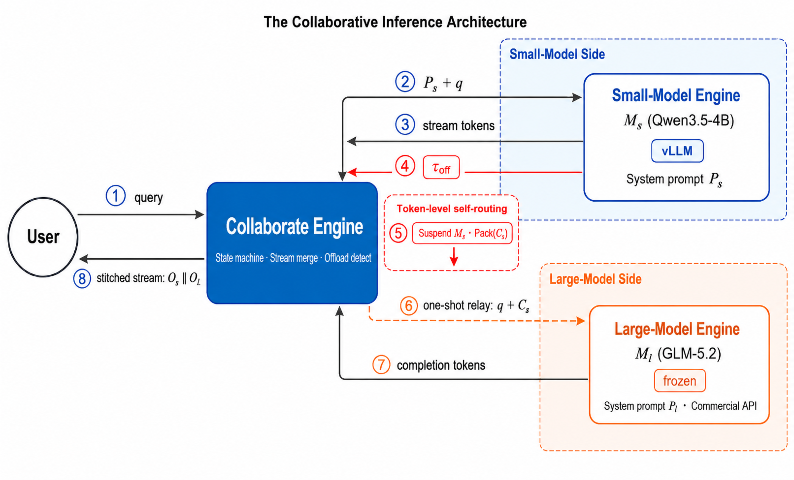
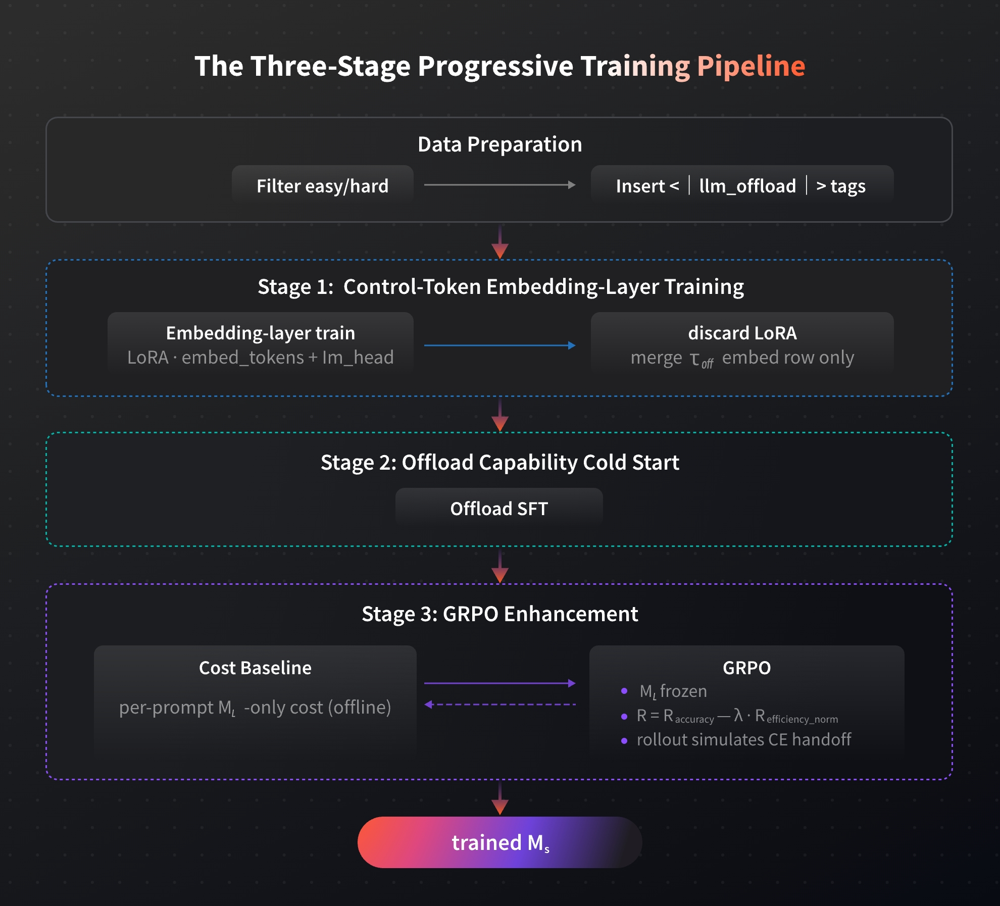
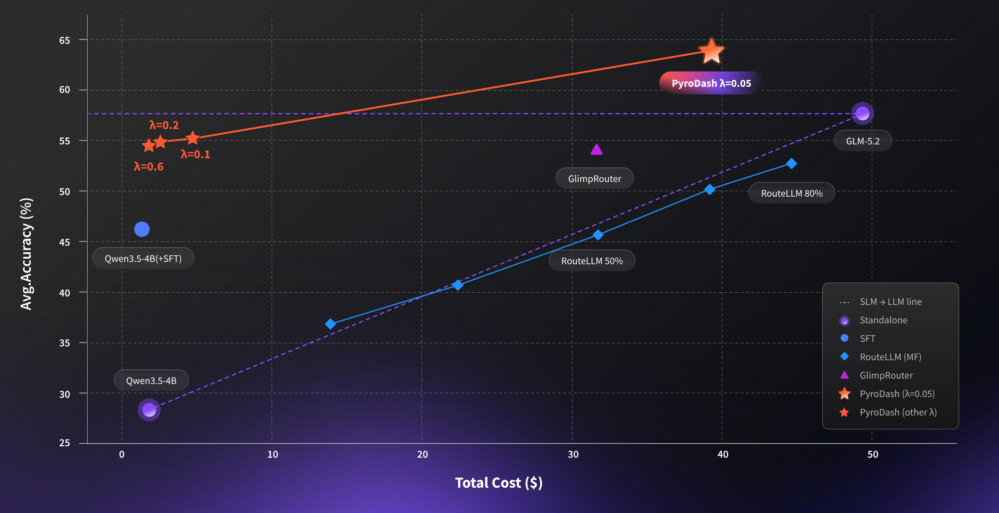

# pyroDash

**Language / 语言:** [English](README.md) | [中文](README_zh.md)

<a href="https://PyroMind-Dynamics.github.io/pyroDash/"></a>&nbsp;&nbsp;<a href="#-citation"></a>&nbsp;&nbsp;<a href="https://huggingface.co/pyromind"></a>

---

## 🔥 Updates

- **2026-07-22**：发布项目主页、数学评测代码、[EasyHard-24K](https://huggingface.co/datasets/pyromind/easyhard-24k)，以及模型（见 [Hugging Face · pyromind](https://huggingface.co/pyromind)：[SFT](https://huggingface.co/pyromind/PyroDash-4B-SFT)、[GRPO λ=0.05](https://huggingface.co/pyromind/PyroDash-4B-GRPO-Lambda-0.05)、[GRPO λ=0.6](https://huggingface.co/pyromind/PyroDash-4B-GRPO-Lambda-0.6)）。Milestone 1 数学评测闭环基本完成；Collaborate Engine 与一键复现仍在进行中。

---

<table>
<tr>
<td width="50%" valign="top">

</td>
<td width="50%" valign="top">

我们提出 **PyroDash**，一种面向小模型与大模型协同推理的 Token 级动态推理范式。小模型在自回归流式解码中自行输出控制符 `<|llm_offload|>`，协同引擎据此将局部推理链一次性转交大模型补全。无需外接 Router 模型，亦无需重训练大模型，并兼容闭源大模型服务。

</td>
</tr>
</table>

训练上，PyroDash 采用三阶段渐进式优化管线：（1）训练控制符嵌入层，使小模型具备基本的 offload 表达能力；（2）冷启动 offload 能力，建立大小模型协作模式；（3）以 GRPO 强化学习联合优化动态 offload 策略，结合任务准确率奖励与大模型调用成本惩罚，在推理质量与算力成本之间取得自适应平衡。更多细节请见下方论文引用。

<p align="center">
  
</p>

---

## 🚀 快速开始

### 1. 环境准备

```bash
git clone https://github.com/PyroMind-Dynamics/pyroDash.git
cd pyroDash
pip install -r requirements.txt
```

### 2. 运行评测（`evaluation/math_eval.sh`）

先修改 [`evaluation/math_eval.sh`](evaluation/math_eval.sh) 中的占位参数，再执行：

```bash
bash evaluation/math_eval.sh
```

脚本流程：(1) 在本地 `8001` 端口用 **vLLM** 拉起小模型；(2) 运行 `math_eval.py`；(3) 结束时自动停止 vLLM。

#### 参数说明

| 变量 / 参数 | 含义 | 示例 |
|-------------|------|------|
| `MODEL` | 本地 merged 模型路径（给 vLLM serve + tokenizer） | `/path/to/your/merged_model` |
| `--glm-base-url` | 大模型 / 接力模型的 OpenAI 兼容 API 地址 | `http://your-glm-host:8000/v1` |
| `--glm-api-key` | 该接口的 API Key | `your-glm-api-key` |
| `--glm-model` | GLM 侧已部署的模型名 | `your-glm-model` |
| `--output-dir` | 各数据集 JSON 结果输出目录 | `./results_500` |
| `--datasets` | 评测集（空格分隔） | `gsm8k minerva olympiad aime2024 aime2025` |

Tokenizer 必须包含特殊 token `<|llm_offload|>`。

---

## 📊 Results

<p align="center">
  
</p>

---

## 📋 TODO

**Milestone 1 — Math 场景评测闭环**

- [x] 基线：GLM-5.2 上界 / Qwen3.5-4B 下界 + Token 成本统计
- [x] vLLM + GLM relay（`<|llm_offload|>`）+ per-dataset JSON + 费用汇总
- [x] 对比：PyroDash / Query Router / Token Router + 帕累托曲线
- [x] λ 扫描与消融
- [ ] [PyroMind Console](https://pyromind.ai/) 一键复现（端到端评测）
- [ ] Collaborate Engine

**Milestone 2 — Coding + Agentic**

- [ ] SWE-Bench（Verified / Lite）harness
- [ ] Terminal-Bench v2 harness
- [ ] Sandbox / 判分 + offload 轨迹与 Token 统计
- [ ] Qwen3.5-4B / GLM-5.2 / PyroDash 对比 + 成本表
- [ ] Math + SWE + Terminal 统一结果表与端到端脚本

**Milestone 3 — 发布 Coding Plan**

- [ ] 产品定义与协同推理引擎集成
- [ ] 编程场景专项优化（补全 / 重构 / Debug）
- [ ] 发布与推广

---

## 🔗 相关资源

| 资源 | 链接 |
|------|------|
| 项目官网 | [PyroMind-Dynamics.github.io/pyroDash](https://PyroMind-Dynamics.github.io/pyroDash/) |
| 论文 | Preprint — 见 [Citation](#-citation) |
| 数据集（EasyHard-24K） | [huggingface.co/datasets/pyromind/easyhard-24k](https://huggingface.co/datasets/pyromind/easyhard-24k) |
| Hugging Face 组织 | [huggingface.co/pyromind](https://huggingface.co/pyromind) |

---

## 📖 Citation

如果本工作对你有帮助，请引用：

```bibtex
@misc{pyrodash2026,
  title        = {PyroDash: Cost-Efficient Token-Level Small-Large Model Collaborative Inference},
  author       = {{PyroMind Dynamics}},
  year         = {2026},
  note         = {Preprint}
}
```

数据集：

```bibtex
@misc{pyromind2026easyhard24k,
  title        = {{EasyHard-24K} v0.02},
  author       = {{PyroMind Dynamics}},
  year         = {2026},
  howpublished = {\url{https://huggingface.co/datasets/pyromind/easyhard-24k}}
}
```
