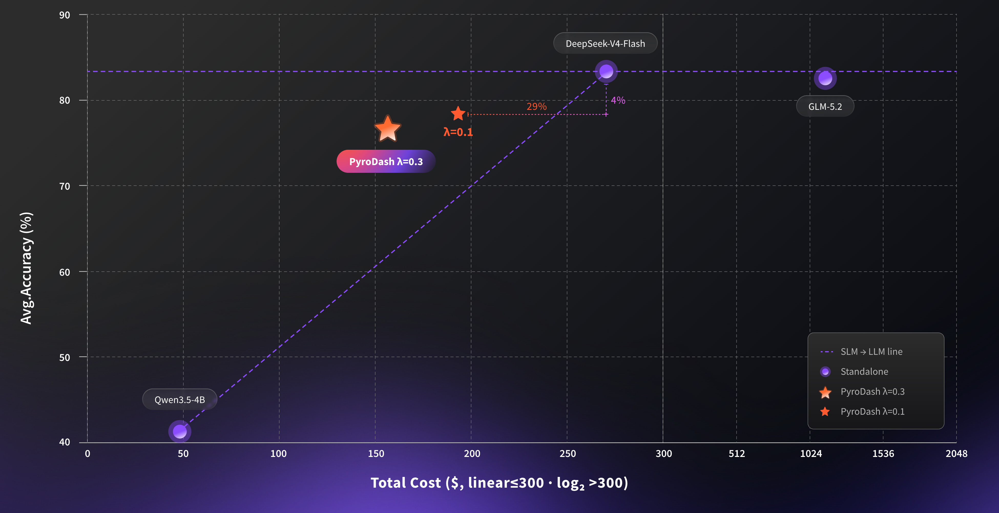

# PyroDash

**Language / 语言:** [English](README.md) | [中文](README_zh.md)

    

---

## 🔥 Updates

- **2026-09-01**：**Agentic-Preview**：我们使用 **SFT + OPD + GRPO** 完成了初步训练，训练数据集与场景正在扩增中。结果显示，在 SWE-Bench Verified 上可在**节省约 20% 成本**的同时仅降低约 5% 精度；更多训练与实验正在进行中。我们预计在 1 个月后发布相应的稳定版本。
- **2026-07-23**：论文发布于 [arXiv:2607.20327](https://arxiv.org/abs/2607.20327)。
- **2026-07-22**：发布项目主页、数学评测代码、[EasyHard-24K](https://huggingface.co/datasets/pyromind/easyhard-24k)，以及模型（见 [Hugging Face · pyromind](https://huggingface.co/pyromind)：[SFT](https://huggingface.co/pyromind/PyroDash-4B-SFT)、[GRPO λ=0.05](https://huggingface.co/pyromind/PyroDash-4B-GRPO-Lambda-0.05)、[GRPO λ=0.6](https://huggingface.co/pyromind/PyroDash-4B-GRPO-Lambda-0.6)）。Milestone 1 数学评测闭环基本完成；Collaborate Engine 与一键复现仍在进行中。


## 📊 Results


| Agentic-Preview                                                                              | Math                                                                       |
| -------------------------------------------------------------------------------------------- | -------------------------------------------------------------------------- |
|  |  |


> [!IMPORTANT]
> **Agentic-Preview 更新**
>
> - 控制符由 `<|llm_offload|>` 升级为 `<|llm_offload|>N<|/llm_offload|>`，其中 N 为 0–9 的整数，用于在转交更强模型时选择 thinking level（更细粒度的 agentic coding 协作）。
> - 第二阶段训练由单独的 offload SFT 升级为 **SFT + OPD**，强化 agentic coding 轨迹上的冷启动 offload 策略。
> - Agentic coding 训练数据集：**ScaleSWE**、**TMax**。
> - 评测方式：见 [`evaluation/evaluation_code/README.md`](evaluation/evaluation_code/README.md)
> - 更多细节后续发布。

---


## 💡 概述

<table>
<tr>
<td width="50%" valign="top"></td>
<td width="50%" valign="middle">我们提出 <b>PyroDash</b>，一种面向小模型与大模型协同推理的 Token 级动态推理范式。小模型在自回归流式解码中自行输出控制符 <code>&lt;|llm_offload|&gt;</code>，协同引擎据此将局部推理链一次性转交大模型补全。无需外接 Router 模型，亦无需重训练大模型，并兼容闭源大模型服务。</td>
</tr>
</table>

训练上，PyroDash 采用三阶段渐进式优化管线：（1）训练控制符嵌入层，使小模型具备基本的 offload 表达能力；（2）冷启动 offload 能力，建立大小模型协作模式；（3）以 GRPO 强化学习联合优化动态 offload 策略，结合任务准确率奖励与大模型调用成本惩罚，在推理质量与算力成本之间取得自适应平衡。更多细节请见下方论文引用。

<p align="center">
  
</p>

---


## 🚀 快速开始


### 1. 环境准备

```bash
git clone https://github.com/PyroMind-Dynamics/PyroDash.git
cd PyroDash
pip install -r requirements.txt
```


### 2. 运行评测（`evaluation/evaluation_math/math_eval.sh`）

先修改 [`evaluation/evaluation_math/math_eval.sh`](evaluation/evaluation_math/math_eval.sh) 中的占位参数，再执行：

```bash
bash evaluation/evaluation_math/math_eval.sh
```

脚本流程：(1) 在本地 `8001` 端口用 **vLLM** 拉起小模型；(2) 运行 `math_eval.py`；(3) 结束时自动停止 vLLM。

#### 参数说明


| 变量 / 参数          | 含义                               | 示例                                         |
| ---------------- | -------------------------------- | ------------------------------------------ |
| `MODEL`          | 本地模型路径（给 vLLM serve + tokenizer） | `/path/to/your/slm_model`                  |
| `--glm-base-url` | 大模型 / 接力模型的 OpenAI 兼容 API 地址     | `http://your-glm-host:8000/v1`             |
| `--glm-api-key`  | 该接口的 API Key                     | `your-glm-api-key`                         |
| `--glm-model`    | GLM 侧已部署的模型名                     | `your-glm-model`                           |
| `--output-dir`   | 各数据集 JSON 结果输出目录                 | `./results_500`                            |
| `--datasets`     | 评测集（空格分隔）                        | `gsm8k minerva olympiad aime2024 aime2025` |


Tokenizer 必须包含特殊 token `<|llm_offload|>`。

---


## 📋 TODO

**Milestone 1 — Math 场景评测闭环**

- [x] 基线：GLM-5.2 上界 / Qwen3.5-4B 下界 + Token 成本统计
- [x] vLLM + GLM relay（`<|llm_offload|>`）+ per-dataset JSON + 费用汇总
- [x] 对比：PyroDash / Query Router / Token Router + 帕累托曲线
- [x] λ 扫描与消融
- [ ] [PyroMind Console](https://pyromind.ai/) 一键复现（端到端评测）
- [x] Collaborate Engine

**Milestone 2 — Coding + Agentic**

- [x] SWE-Bench（Verified / Lite）harness
- [ ] Terminal-Bench v2 harness
- [x] Sandbox / 判分 + offload 轨迹与 Token 统计
- [x] Qwen3.5-4B / GLM-5.2 / PyroDash 对比 + 成本表
- [x] Math + SWE + Terminal 统一结果表与端到端脚本
- [ ] 优化 agentic 效果

**Milestone 3 — 发布 Coding Plan**

- [ ] 产品定义与协同推理引擎集成
- [ ] 编程场景专项优化（补全 / 重构 / Debug）
- [ ] 发布与推广

---


## 🔗 相关资源


| 资源                | 链接                                                                                                     |
| ----------------- | ------------------------------------------------------------------------------------------------------ |
| 项目官网              | [PyroMind-Dynamics.github.io/PyroDash](https://PyroMind-Dynamics.github.io/PyroDash/)                  |
| 论文                | [arXiv:2607.20327](https://arxiv.org/abs/2607.20327)                                                   |
| 数据集（EasyHard-24K） | [huggingface.co/datasets/pyromind/easyhard-24k](https://huggingface.co/datasets/pyromind/easyhard-24k) |
| Hugging Face 组织   | [huggingface.co/pyromind](https://huggingface.co/pyromind)                                             |


---


## 📖 Citation

如果本工作对你有帮助，请引用：

```bibtex
@misc{lyu2026pyrodash,
  title        = {PyroDash: Cost-Efficient Token-Level Small-Large Language Model Collaborative Inference},
  author       = {Niqi Lyu and Pengtao Shi and Wei Qiu and Jianlin Zhong and Sicong Xia and Jianyao Ma and Yicheng Ding},
  year         = {2026},
  eprint       = {2607.20327},
  archivePrefix= {arXiv},
  primaryClass = {cs.CL},
  url          = {https://arxiv.org/abs/2607.20327}
}
```

数据集：

```bibtex
@misc{pyromind2026easyhard24k,
  title        = {{EasyHard-24K} v0.02},
  author       = {{PyroMind Dynamics}},
  year         = {2026},
  howpublished = {\url{https://huggingface.co/datasets/pyromind/easyhard-24k}}
}
```

