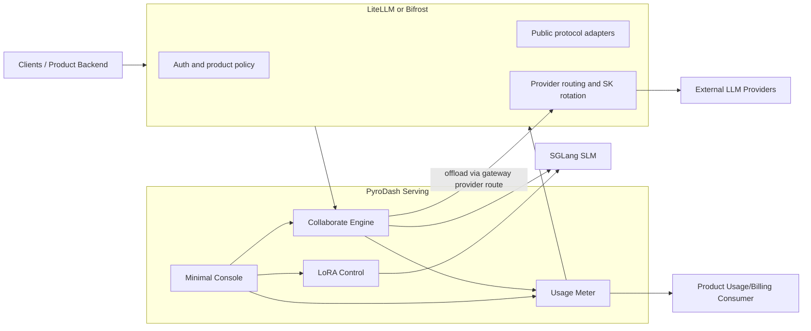

# PyroDash Serving Plan

> Goal: turn the current evaluation prototype into a collaborative inference service that plugs into LiteLLM or Bifrost and satisfies the serving requirements: dynamic LoRA, provider key switching, multiple client protocols, hot switching, performance, and split SLM/LLM usage.

## 1. Scope

PyroDash owns:

- SGLang-based SLM serving.
- The Collaborate Engine and `<|llm_offload|>` handoff.
- Thin control APIs for SGLang LoRA load/unload and model selection.
- Integration with Gateway-managed LLM providers and SK rotation.
- Compatibility validation for Claude Code/Anthropic, OpenAI Chat Completions, and OpenAI Responses.
- Hot switching of LoRA, SLM endpoints, and LLM routes.
- SLM/LLM token, latency, routing, and cost metering.
- A minimal Serving/Usage/Playground console.

The product frontend/backend owns users, authentication, balances, payment, and account management. It consumes PyroDash Usage Events through a stable interface.

## 2. Now vs Target

| Area | Now | Target |
|---|---|---|
| Runtime | CLI evaluation script | Long-running serving service |
| SLM | vLLM started by shell | SGLang service |
| Collaboration | Non-streaming relay functions | Streaming Collaborate Engine |
| LoRA | Merged model path | SGLang dynamic LoRA load/unload |
| LLM access | One GLM URL and SK | Gateway-managed providers and SK rotation |
| Protocols | Internal Python calls | Claude Code, Chat Completions, Responses |
| Switching | Restart and edit arguments | LoRA/endpoint/provider hot switching |
| Usage | Evaluation JSON | Standard split SLM/LLM Usage Event |
| Performance | Thread-pool benchmark | Async streaming, metrics, load testing |

## 3. Architecture



The final choice between LiteLLM and Bifrost is shared with the product frontend/backend team. PyroDash integrates through interfaces and does not fork either gateway.

## 4. Request Flow

```text
Client request
→ LiteLLM/Bifrost authenticates and normalizes the request
→ PyroDash Collaborate Engine
→ SGLang streams SLM output
→ Engine detects <|llm_offload|>
→ optional LLM request through the configured Gateway provider route
→ Engine joins the two streams
→ PyroDash emits split Usage
→ Gateway converts the stream to the client protocol
```

The internal contract uses protocol-neutral types:

```text
UnifiedRequest
├── request_id
├── model / lora
├── messages or input
├── tools
├── sampling parameters
└── metadata

UnifiedEvent
├── TextDelta
├── ReasoningDelta
├── ToolCallDelta
├── Usage
├── Completed
└── Error
```

Gateway adapters translate:

- Anthropic Messages used by Claude Code.
- OpenAI `/v1/chat/completions`.
- OpenAI `/v1/responses`.

PyroDash validates end-to-end streaming, reasoning, tool-call, cancellation, error, and usage behavior for each protocol. A direct compatibility shim is added only when the selected Gateway cannot provide the required mapping.

## 5. Collaborate Engine

1. Resolve the requested SLM endpoint and LoRA name.
2. Start the SGLang streaming request.
3. Forward safe SLM chunks immediately.
4. Detect `<|llm_offload|>` with a cross-chunk buffer so the marker cannot leak or be missed.
5. If no marker appears, finish as SLM-only.
6. If it appears, stop the SLM stage and package the original request plus partial reasoning.
7. Call the LLM through the Gateway provider route.
8. Append the LLM stream to the response.
9. Emit the final split Usage Event.

Core interfaces:

```text
SLMTransport       SGLang HTTP/SSE first; gRPC can be added later
LLMRoute           Gateway-managed provider route
LoRAControl        Thin wrapper over SGLang LoRA APIs
UsageMeter         Request-local SLM/LLM aggregation
UsageSink          Delivery to product backend or another sink
```

## 6. Dynamic LoRA

The base model remains fixed in SGLang. SGLang owns LoRA weight loading, GPU/CPU memory pools, multi-LoRA batching, LRU/FIFO eviction, and inference kernels.

PyroDash only owns:

- Public model name to SGLang LoRA name/path mapping.
- Calls to SGLang load/unload/status APIs.
- Request routing to a selected LoRA.
- Administrative visibility and load/unload metrics.

Configuration:

```yaml
loras:
  pyrodash-gamma-05:
    path: /models/pyrodash-gamma-05
    pinned: true
  pyrodash-gamma-005:
    path: /models/pyrodash-gamma-005
    pinned: false
```

Control endpoints:

```text
GET    /internal/loras
POST   /internal/loras/{name}/load
DELETE /internal/loras/{name}
```

Two concurrent requests may select different loaded LoRAs while sharing the same immutable base model. PyroDash does not merge/unmerge matrices per request; SGLang applies the selected LoRA inside each sequence's layer computation.

Initial SGLang settings to validate:

```text
--enable-lora
--max-lora-rank
--max-loras-per-batch
--max-loaded-loras
--lora-eviction-policy lru
--enable-lora-overlap-loading
```

## 7. Provider SK Switching

SK storage, rotation, retry, and provider load balancing should use LiteLLM/Bifrost capabilities rather than a second PyroDash credential system.

PyroDash integration must verify:

- Multiple keys per provider/model.
- Key switch on 401/403, 429, timeout, and configured 5xx errors.
- No SK plaintext in logs, events, or Console.
- A stable `provider`, `model`, `route_id`, and safe `credential_id` in Usage.
- Configuration reload without restarting PyroDash.

If the selected Gateway does not expose a required key-switch capability, add it through the Gateway's supported plugin/hook interface rather than forking its request core.

## 8. Hot Switching

Hot-switchable resources:

- LoRA adapter.
- SGLang endpoint/version.
- Gateway LLM route/provider.
- Provider key, managed by Gateway.

Switch process:

```text
prepare new resource
→ health check
→ atomically update route for new requests
→ keep existing requests on their original route
→ retire old resource after in-flight requests finish
```

Each request captures a routing snapshot at start:

```text
slm_endpoint
base_model
lora_name
llm_provider/model/route
pricing_version
```

## 9. Usage and Cost

Every request emits one final Usage Event, including failed, timed-out, or disconnected requests when tokens were consumed.

```json
{
  "request_id": "req_xxx",
  "status": "completed",
  "offloaded": true,
  "offload_token_index": 430,
  "slm": {
    "base_model": "qwen-base",
    "lora": "pyrodash-gamma-05",
    "prompt_tokens": 120,
    "completion_tokens": 430,
    "ttft_ms": 85,
    "duration_ms": 2100,
    "cost": "0.000098"
  },
  "llm": {
    "provider": "glm",
    "model": "glm-x",
    "route_id": "glm-primary",
    "prompt_tokens": 510,
    "completion_tokens": 780,
    "ttft_ms": 320,
    "duration_ms": 6300,
    "cost": "0.014250"
  },
  "total_cost": "0.014348",
  "currency": "CNY"
}
```

Rules:

- Track SLM and LLM prompt/completion tokens separately.
- Prefer authoritative upstream usage; use the matching tokenizer as fallback and label the source.
- Use `Decimal` and `config/pricing.yaml` for cost calculation.
- Return Usage in the final protocol response/event.
- Publish the same canonical event through `UsageSink`.

The first `UsageSink` implementations are JSONL for local debugging and an HTTP callback contract for the product backend.

## 10. Performance

Implementation:

- Async I/O end to end.
- Reused HTTP/SSE connection pools.
- Immediate downstream forwarding of safe SLM chunks.
- Separate SLM and LLM concurrency controls.
- No per-token database or network callback.
- Request-local usage aggregation and one final Usage Event.
- Optional SGLang gRPC transport after HTTP/SSE profiling.

Measure:

```text
Gateway and PyroDash overhead
SLM/LLM TTFT, TPOT, tokens/s, and duration
Offload transition latency
LoRA load/unload latency and cache hit/miss
Request throughput and concurrency
Hot-switch success/failure
Provider key switch count
SLM/LLM token and cost totals
```

## 11. Minimal Demo Console

| Page | Necessary content |
|---|---|
| `/console/serving` | SGLang health, loaded LoRAs, load/unload actions, Gateway route health |
| `/console/playground` | Protocol/model/LoRA selection, streamed answer, offload state |
| `/console/usage` | SLM/LLM tokens, latency, route, and estimated cost |

The Console uses FastAPI, Jinja2, HTMX, and minimal JavaScript for streaming. It calls the same internal service APIs and contains no user, balance, or payment logic.

## 12. Code Layout

```text
PyroDash/
├── app/
│   ├── main.py
│   ├── contracts/          # UnifiedRequest/Event and Usage Event
│   ├── engine/             # Collaborate Engine
│   ├── transports/         # SGLang HTTP/SSE; optional gRPC
│   ├── lora/               # Thin SGLang LoRA control
│   ├── gateway/            # LiteLLM/Bifrost integration
│   ├── usage/              # Meter, pricing, sinks
│   ├── console/
│   └── observability/
├── config/
│   ├── models.yaml
│   ├── loras.yaml
│   ├── gateway.yaml
│   └── pricing.yaml
├── templates/
├── static/
├── evaluation/             # Existing regression baseline
├── Dockerfile
├── compose.yaml
└── pyproject.toml
```

## 13. Delivery Phases

### Phase 1: contracts and gateway decision

- [ ] Freeze model, tokenizer, Offload Token, and evaluation baseline.
- [ ] Define UnifiedRequest, UnifiedEvent, Usage Event, and HTTP callback.
- [ ] Compare LiteLLM/Bifrost against required protocols, SK switching, streaming, and hooks.
- [ ] Agree integration contracts with the product frontend/backend team.

### Phase 2: serving core

- [ ] Launch PyroDash SLM with SGLang.
- [ ] Implement SGLang streaming transport.
- [ ] Implement Collaborate Engine and cross-chunk marker detection.
- [ ] Implement SLM-only and SLM-to-LLM streaming.
- [ ] Propagate cancellation, timeout, and errors.

### Phase 3: LoRA and hot switching

- [ ] Wrap SGLang LoRA load/unload/status APIs.
- [ ] Route concurrent requests to different LoRAs.
- [ ] Configure and validate SGLang multi-LoRA and LRU behavior.
- [ ] Implement endpoint and route snapshots for hot switching.

### Phase 4: protocols, SK switching, and usage

- [ ] Validate Claude Code/Anthropic Messages.
- [ ] Validate OpenAI Chat Completions.
- [ ] Validate OpenAI Responses.
- [ ] Validate Gateway SK rotation/failover scenarios.
- [ ] Implement split token, latency, routing, and cost Usage.
- [ ] Implement JSONL and HTTP callback Usage sinks.

### Phase 5: performance and demo

- [ ] Profile Gateway, Engine, SGLang, LoRA, and offload overhead.
- [ ] Validate hot switching without interrupting in-flight requests.
- [ ] Implement Serving, Playground, and Usage Console pages.
- [ ] Add Docker Compose, health endpoints, metrics, and runbook.

## 14. Acceptance Criteria

- [ ] The selected LiteLLM/Bifrost Gateway routes supported client protocols to PyroDash.
- [ ] SLM-only and SLM-to-LLM streaming both work.
- [ ] SGLang loads/unloads LoRAs dynamically and serves concurrent LoRA variants.
- [ ] Provider SK failover works without exposing secrets or restarting PyroDash.
- [ ] LoRA, SLM endpoint, and LLM route switching do not interrupt in-flight requests.
- [ ] Every request produces complete split SLM/LLM token, latency, route, and cost data.
- [ ] The product backend can consume Usage through the agreed response/event/callback contract.
- [ ] The Console shows only serving state, playground output, and usage.
- [ ] Existing evaluation results have no unexplained regression.
